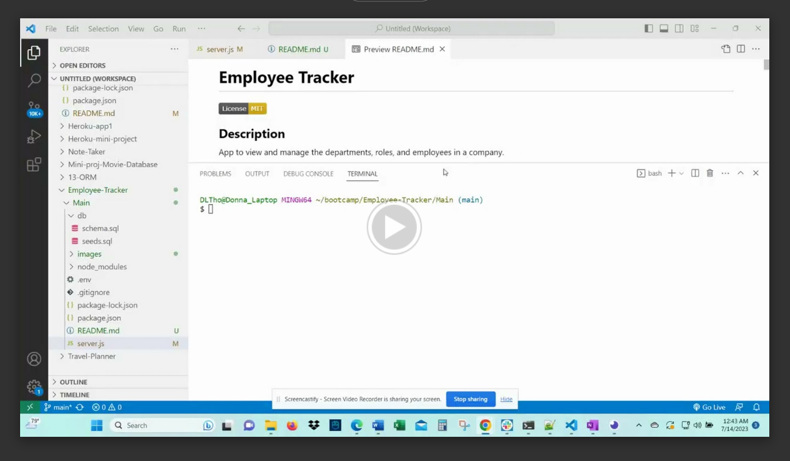

# **Employee Tracker**

  

  ## **Description**
  App to view and manage the departments, roles, and employees in a company.

  ## **Table of Contents:**
  * [Installation](#installation)
  * [Usage](#usage)
  * [Credits](#credits)
  * [Contribute](#contribute)
  * [Tests](#tests)
  * [License](#license)
  * [Questions](#questions)

  ## **Installation**
  To install a public package, on the command line, run npm install <package_name> This will create the node_modulesdirectory in your current directory (if one doesnt exist yet) and will download the package to that directory. You can check to see if you already have node.js installed by running either the npm -v or the npm version command. Note:If there is no package.jsonfile in the local directory, the latest version of the package is installed.

  ## **Usage**
  WHEN I start the application THEN I am presented with the following options: view all departments, view all roles, view all employees, add a department, add a role, add an employee, and update an employee role. WHEN I choose to view all departments, THEN I am presented with a formatted table showing department names and department ids. WHEN I choose to view all roles, THEN I am presented with the job title, role id, the department that role belongs to, and the salary for that role. WHEN I choose to view all employees, THEN I am presented with a formatted table showing employee data, including employee ids, first names, last names, job titles, departments, salaries, and managers that the employees report to. WHEN I choose to add a department, THEN I am prompted to enter the name of the department and that department is added to the database. WHEN I choose to add a role, THEN I am prompted to enter the name, salary, and department for the role and that role is added to the database. WHEN I choose to add an employee, THEN I am prompted to enter the employee’s first name, last name, role, and manager, and that employee is added to the database. WHEN I choose to update an employee role, THEN I am prompted to select an employee to update and their new role and this information is updated in the database 

  ### **Demo of how to use the Employee Tracker:**

  ## **Credits**
  Donna Thompson

  ## **Contribute**
  If you would like to contribute to this app, please follow the guidelines of The Contributor Convenant. Submit contributions to the email below.

  ## **Tests**
  Test case 1: enter all info correctly. Test Case 2: Enter partial info.

  ## **License**
Licensed under [The MIT License](https://opensource.org/licenses/MIT).

  ## **Questions**
  Please visit my GitHub profile at https://github.com/DonnaThompson7   Contact me at dlthompson7@icloud.com to report issues or if you have additional questions.
